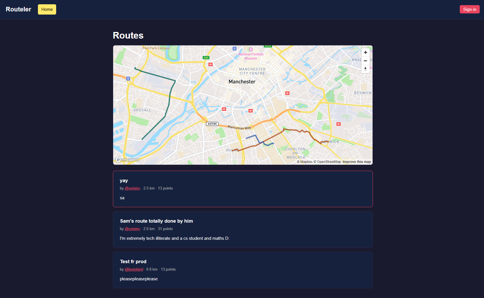
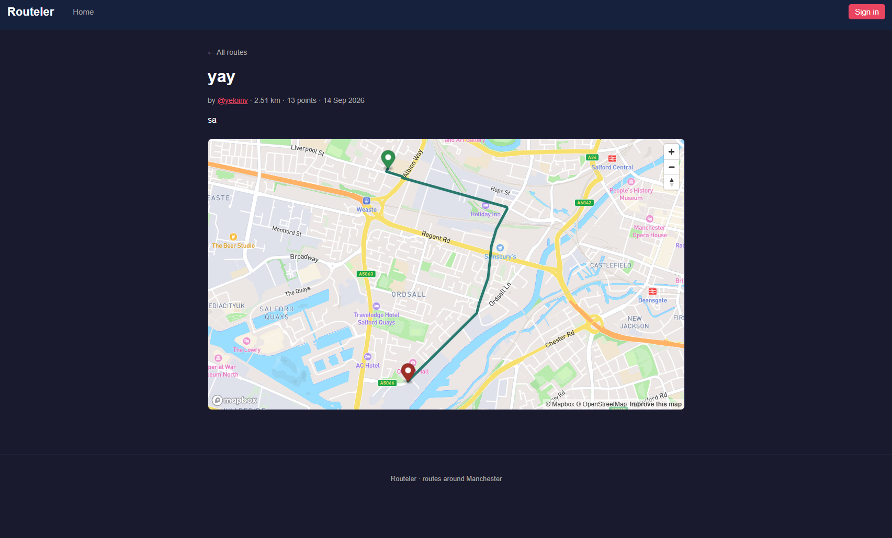
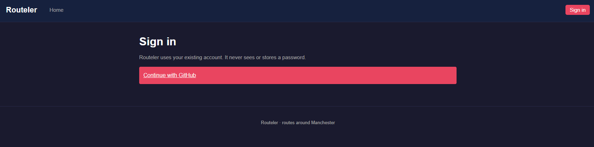
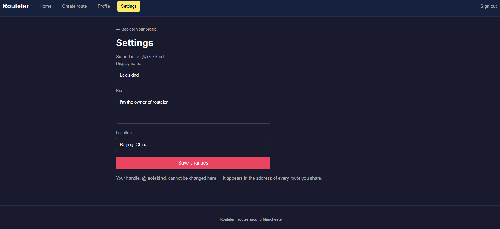
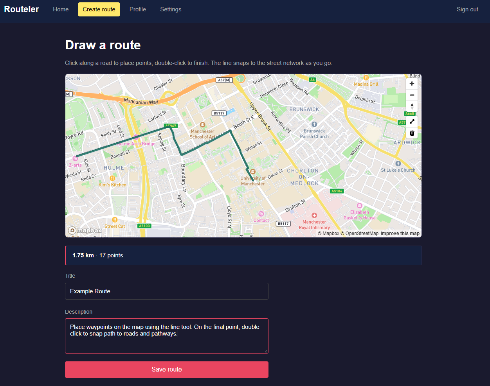

# Routeler

A site for sharing routes made using the MapBox API

[](https://github.com/Leoiskind/Routeler/actions/workflows/ci.yml)

**Live:** https://routeler.onrender.com
Due to our database host's (Aiven) free tier the database is not always up. Please message me personally if you want to view the project.


## What it does
### View user created routes

### Sign into and customise account using GitHub


### Create and share routes


## Background
Initially started as a team project for year 1 of university.
Scaled back functionality such as:
* Used proprietary university authentication
* None robust database
* Unsafe credential storing
### Changes:
* Uses GitHub OAuth allowing anyone to access
* Restructuring of database schema and REST API including storing snapped coordinates to reduce MapBox API calls
* Removing private MapBox credentials from source code using git-filter-repo


## Stack
**Application** - PHP 8.3, no framework
<p>Project was written in PHP with no framework, kept so additions can build onto original work without complete refactor</p>

**Database** - MySQL 8.4
<p>Project initially used SQL. For an MVP and for reducing space taken on free tier database host (Aiven) MySQL was more than adequate over the more stringent requirements of Postgres</p>

**Maps** - Mapbox GL JS & Map Matching API
<p>Mapbox has a generous free tier. Mapbox API has well documented and easy to follow tutorials with relevant tools to the app. This includes, rendering the map and snapping drawn points to roads</p>

**Hosting** - Render (app) & Aiven (database)
<p>Render has a great free tier for hosting allowing constant uptime 24/7. Render is compatible with MySQL and can be hosted from GitHub repository. Aiven has a generous free tier for MySQL and both Aiven and Render require no card for setup</p>

**Tooling** - Composer, PHPStan (level 5), PHPUnit, Docker, GitHub Actions
* Composer - Used as a dependency manager so CI installs and constructs the exact same container
* PHPStan - A static analyser that enforces good programming practices before merging to main
* PHPUnit - Runs test scripts in tests folder that load a production schema and perform tests on SQL queries
* Docker - Packages the app so development environment is the same as the active product hosted on render
* GitHub Actions - The CI runner, on every pull request starts an Ubuntu machine, installs locked dependencies using Composer and runs PHPUnit and PHPStan tests before approving merging to main

## Architecture
### Request Lifecycle
Starting from request: GET /route.php?id=7
1. Apache picks the file, document root is moved to /var/www/html/public (nothing above public is accessible)
2. The page requires bootstrap. src/bootstrap.php requires Composer's autoloader, starts session and defines helper functions
3. Page validates input. A malformed id returns error 400
4. pdo() is called for the first time, which requires config/db.php, reads the environment variables and opens the connection ensuring only relevant pages connect
5. SQL is executed returning a single route with an array of coordinates
6. If a valid route is returned through find(), route is rendered. If find() returns null, not-found view is rendered instead and error 404 is returned
7. Route is extracted as a local variable and page is constructed, with values escaped on output via e()
8. Points are supplied to Mapbox as JSON for the JavaScript to draw
9. Process ends, PDO connection closes, session data is written to container's filesystem

### Directory Tree
```
public/                     web root
    index.php
    create.php
    route.php
    profile.php
    settings.php
    api/routes.php
    auth/
        login.php
        callback.php
        logout.php
    assets/css/app.css
src/
    bootstrap.php
    RouteRepository.php
    UserRepository.php
    Auth/
        AuthProvider.php
        GithubProvider.php
        GoogleProvider.php
        Providers.php
        ProviderUser.php
        Session.php
        Http.php
    views/                  layout, nav, and one per page
config/
    db.php
    aiven-ca.pem
docs/schema.mysql.sql
tests/
    DatabaseTestCase.php
    RouteRepositoryTest.php
.github/workflows/
    ci.yml
    deploy.yml
Dockerfile
docker-entrypoint.sh
compose.yaml
```
### Prerequisites
Docker Desktop

## Running it locally
1. Clone
2. Copy .env.example to .env
3. Fill in the values
    * DB_USER and DB_PASS (anything)
    * MAPBOX_TOKEN (free public token from account.mapbox.com)
    * GITHUB_CLIENT_ID and GITHUB_CLIENT_SECRET (from OAuth app created in your GitHub profile)
4. docker compose up -d --build
5. Open localhost:8080

## Configuration
| Variable | Example | Where it comes from |
| --- | --- | --- |
| `DB_USER` | `routeler` | could be anything |
| `DB_PASS` | `localdev` | could be anything |
| `MAPBOX_TOKEN` | `pk.eyJ1...` | Your free public token from account.mapbox.com |
| `GITHUB_CLIENT_ID` | `Ov23li...` | From the OAuth app you create on your GitHub profile |
| `GITHUB_CLIENT_SECRET` | | From the OAuth app you create on your GitHub profile |

## Development
* `docker compose exec web vendor/bin/phpunit` *PHPUnit tests run against real MySQL DatabaseTestCase with config in phpunit.xml*
* `docker compose exec web vendor/bin/phpstan analyse` *Parses src and public and finds contradictions to phpstan at level 5 with config in phpstan.neon*
* `docker compose exec web composer dump-autoload` *Regenerates the autoloader after changing the `autoload` mappings in `composer.json`. Adding a class to an existing namespace needs nothing; adding a namespace does*
* `docker compose logs -f web` *Application logs. The `catch` blocks show the user a generic message and send the real reason here, so a failed OAuth exchange or a rejected insert explains itself. `Ctrl+C` stops watching without stopping the container*

## CI/CD

Every pull request and every push to `main` runs [`ci.yml`](.github/workflows/ci.yml) on a clean Ubuntu runner: PHP 8.3 with dependencies installed from `composer.lock`, a syntax check over `src`, `public` and `tests`, PHPStan at level 5, and PHPUnit against a throwaway MySQL 8 service container. A second job builds the Docker image in parallel — the only check that exercises the Dockerfile's `composer install`, which the test job never touches.

`main` is protected: merges require a pull request and both checks passing, enforced server-side rather than in the UI.

Deployment is a consequence of that rather than of pushing. Render's auto-deploy is off; [`deploy.yml`](.github/workflows/deploy.yml) waits for CI to finish on `main`, checks that it passed, and calls Render's deploy hook. Code that fails CI cannot reach production.

## Known limitations
* Free-tier website host takes 20-30 seconds to start up
* Free-tier database host falls asleep after no use, start-up needs to be done manually


## Licence

MIT - see [LICENSE](LICENSE).